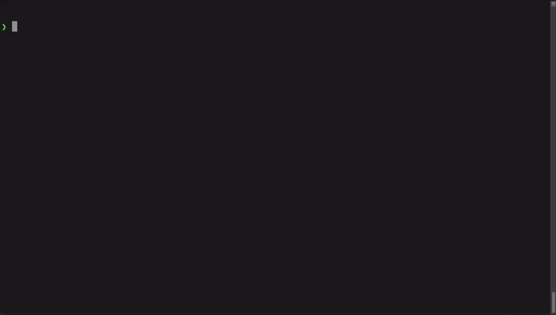

# Bookmark CLI


Bookmark CLI allows you to save your favourite URLs without leaving the terminal and then quickly open them in the browser.




## Installation 


### Released version

Download for Linux:
```bash
wget https://github.com/Szymongib/bookmark-cli/releases/download/v0.0.3/bookmark-linux-amd64

chmod +x bookmark-linux-amd64
sudo mv bookmark-linux-amd64 /usr/local/bin/bookmark
```

Download for Mac OS:
```bash
wget https://github.com/Szymongib/bookmark-cli/releases/download/v0.0.3/bookmark-darwin-amd64

chmod +x bookmark-darwin-amd64
sudo mv bookmark-darwin-amd64 /usr/local/bin/bookmark
```


### Using git and Cargo

```bash
git clone git@github.com:Szymongib/bookmark-cli.git
```
```bash
cd bookmark-cli
```
```bash
cargo install --path .
```


## Usage

Add URL:
```bash
bookmark add GitHub https://github.com
```

Enter interactive mode:
```bash
bookmark
```
Use `enter` to open URL in the browser, `q` to quite the interactive mode and `h` to display help panel.


List URLs:
```bash
bookmark list
```

Delete URL:
```bash
bookmark delete GitHub
```

List groups:
```bash
bookmark group list
```


## Groups and tags

URLs can be added to groups and labeled with tag. Some groups and tags principles include:
- Every URL can be in a single group.
- Every URL can have multiple tags.
- URL names in scope of one group have to be unique.

Some things to consider when using groups and tags:
- If the group is not specified when **adding** the URL, the `default` group is used.
- If the group is not specified when **listing** URLs, all groups are listed. 
- If multiple tags are specified when **listing** URLs, all URLs matching at least one tag are listed.

Use `-g [GROUP_NAME]` flag to add or list URLs from a specified group.
Use `-t [TAG_NAME]` flag/flags to add or list URLs with specified tags.
